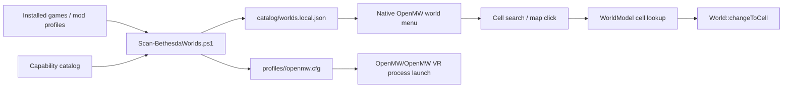

# World Picker Architecture

## Feasibility Answer

The first target is feasible: a dead-world walking simulator that lets us choose a
Bethesda world, choose a starting cell, spawn there, and then rely on OpenMW's
existing neighboring-cell loading and door/cell transition machinery.

The honest support line is:

- Morrowind: fully playable OpenMW target.
- Oblivion, Fallout 3, Fallout: New Vegas, Skyrim-era content, Fallout 4-era
  content: feasible as walking-simulator/world-browser targets.
- Fallout 76: archive/asset research only for now.
- Starfield: future research. The local fork has some BA2 version handling, but
  OpenMW does not yet have enough Creation Engine 2 world/record/material support.
- Oblivion Remastered: out of scope because it is Unreal Engine based.

## Existing Engine Hooks

The local OpenMW fork already has the primitives we need:

- `apps/openmw/mwworld/esmstore.hpp` includes ESM4 stores for cells, worlds,
  statics, references, doors, terrain, items, NPC shells, and FO4-era records.
- `apps/openmw/mwworld/worldmodel.cpp` can resolve ESM4 interior cells by editor
  ID/name and exterior cells by worldspace/grid.
- `apps/openmw/mwworld/worldimp.cpp` has `findInteriorPosition`,
  `findExteriorPosition`, and `changeToCell`.
- `apps/openmw/engine.cpp` already supports a `--start` cell path through
  `Engine::setCell`.
- `apps/openmw/mwgui/mainmenu.cpp` is the native main-menu button surface that VR
  already renders on the menu quad.

That means the menu should not invent loading. It should call the same resolution
path used by `--start`/console COC and then call `World::changeToCell`.

## Clean Data Flow

The scanner now emits both `openmw.cfg` and `settings.cfg` per world. The launch
contract is `--replace config --config <profile-dir>` so OpenMW ignores ambient
user config directories that may still contain Morrowind content or stale detail
settings.

## Menu Shape

The first in-engine menu should be intentionally small:

1. World list.
2. Cell search/list.
3. Exterior map click and coordinate entry.
4. Spawn/jump.

World selection is a profile switch, not an in-process hot swap. OpenMW loads one
content stack at startup; changing from Morrowind to Fallout: New Vegas should
restart OpenMW/OpenMW VR with that world's generated config. Cell selection can
happen in-process once the profile is loaded.

## Cell Catalog Strategy

Phase 1 can use engine runtime stores:

- ESM3: `Store<ESM::Cell>` interiors/exteriors.
- ESM4: `Store<ESM4::Cell>` editor IDs, names, parent worldspace, grid X/Y.
- Spawn position: reuse `World::findInteriorPosition` and
  `World::findExteriorPosition`.

Phase 2 can add an offline cell-ledger export so the menu can show cell counts,
worldspaces, recommended spawn points, and broken/missing asset warnings before
launch.

The map-click path is exterior-only in the first cut. It needs a per-world cell
catalog for worldspace bounds, then a native travel bridge that converts
`worldspace + worldX/worldY` into the destination exterior cell and calls
`World::changeToCell`. Interior cells stay on the search/list path until their
projection rules are stable.

## Implementation Slices

1. Scanner/catalog/profile generator in this repo.
2. Native MyGUI `WorldBrowserWindow` in OpenMW with read-only JSON load.
3. Main menu button `worldbrowser` that opens the browser.
4. `StateManager::newGame(bypass=true)` plus spawn to selected cell.
5. `ViewerTravel` bridge for named-cell, exterior-cell, and exterior-coordinate
   jumps.
6. VR validation: confirm the window appears on the existing menu quad and
   controller pointer activation works.
7. Optional launcher wrapper that restarts flat/VR OpenMW with selected profile.
8. Optional actor inspection mode that opens the recovered FNV Asset Studio flow
   for the selected world's actor records.

## Recovered VR Foundations

The FNV VR hand/Pip-Boy/pointer/HUD work is indexed in
`catalog/fnv-vr-hands-pipboy-recovery.json` and documented in
`docs/vr-hands-pipboy.md`.

For the first viewer, this means the world picker can use the existing OpenMWVR
menu quad, pointer, and wrist HUD path instead of waiting on a new VR UI stack.
The FNVXR retail bridge remains separate until the viewer shell is stable.

## Guardrails

- Never mix Morrowind and ESM4 content in the same profile unless it is an
  intentional compatibility test.
- Keep flat and VR configs separate; VR settings should not leak into flat.
- Mark Starfield and Fallout 76 visibly as research targets until the engine can
  parse their real world records, not just archives.
- Generated profiles should include exact content/archive order and a source hash
  of any profile they were derived from.
- Actor/FaceGen evaluation should stay behind an explicit inspection mode until
  world/cell browsing is stable.
- Prefer existing external binaries and launchers before compiling; configure
  their locations through `local/paths.json` or environment variables.
- Detail settings are per-world. Use `catalog/world-settings-presets.json` and
  `profiles/<world>/settings.cfg`; never rely on the user's global `settings.cfg`
  for viewer runs.
